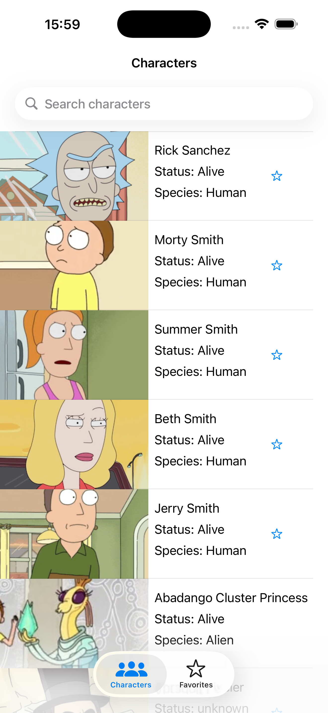
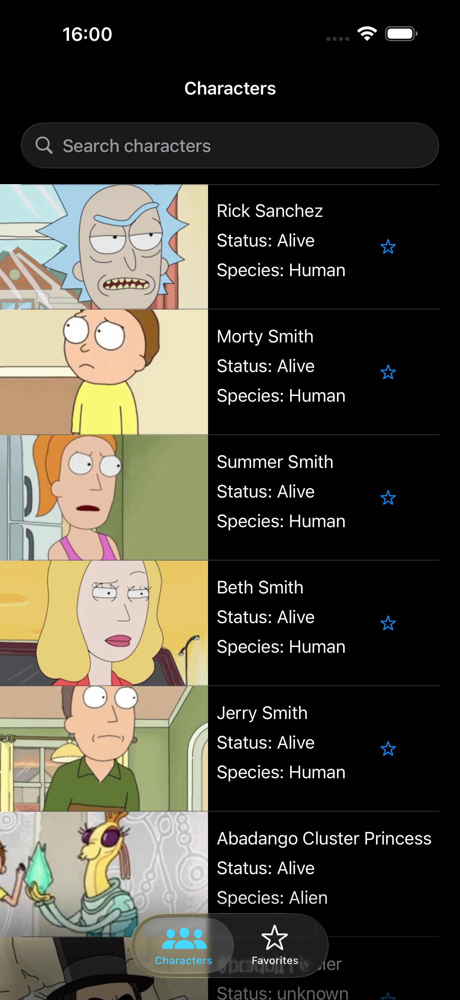
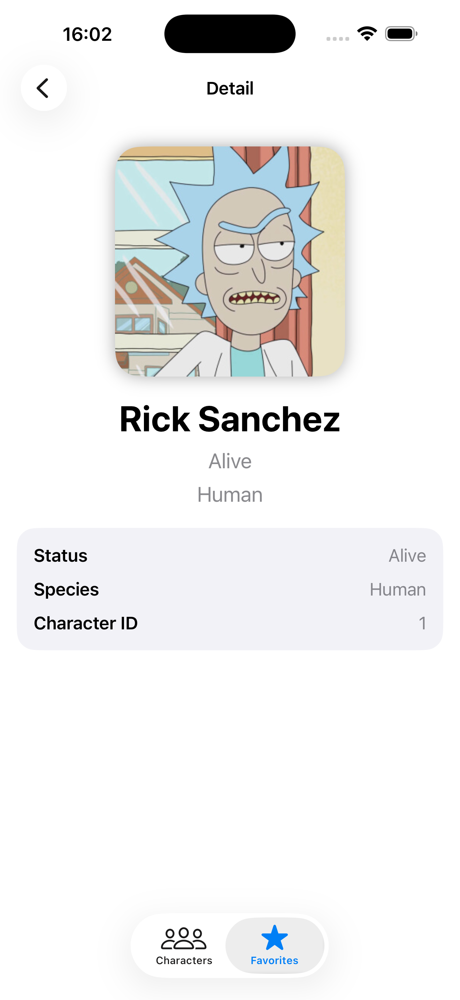
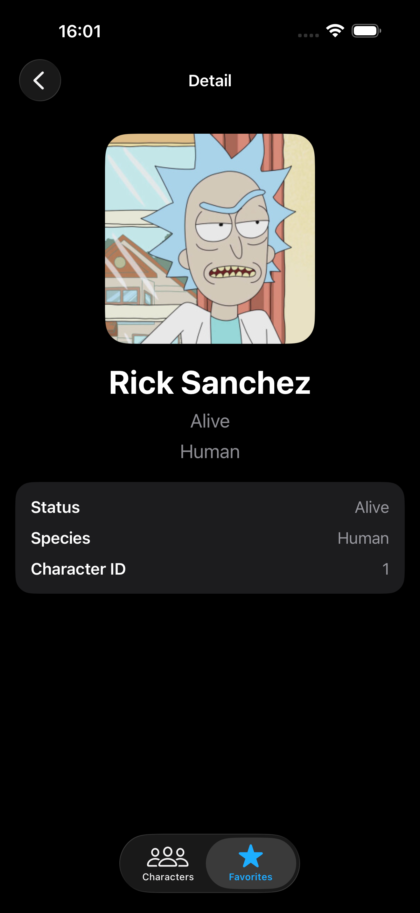
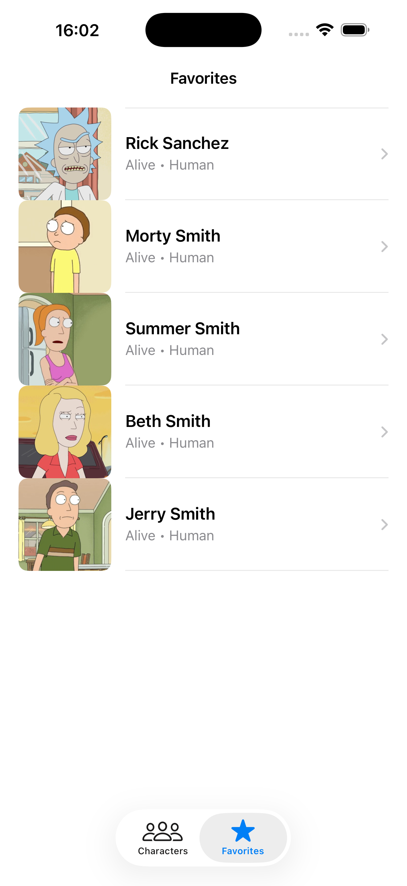
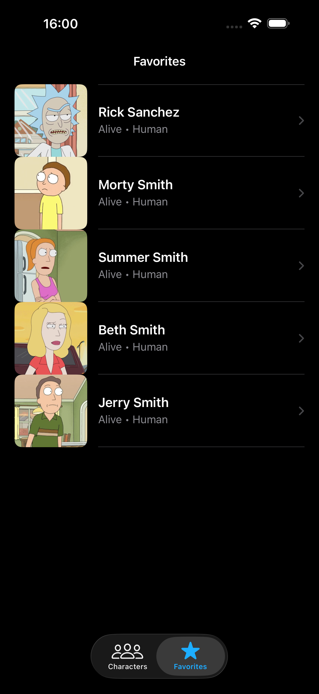

# Rick & Morty iOS App

A native iOS application built with UIKit + SwiftUI that consumes the Rick & Morty API.

This project was developed as part of a technical iOS challenge focused on:
- API integration
- pagination
- local persistence
- UIKit architecture
- SwiftUI interoperability
- offline handling

---

# Features

## Characters List
- Fetch characters from the Rick & Morty API
- Infinite scroll pagination
- Search characters by name
- Dark mode support

## Character Detail
- Detail screen built with SwiftUI
- UIKit → SwiftUI navigation using UIHostingController

## Favorites
- Save favorite characters
- Remove favorites
- Core Data persistence
- Favorites available offline

## Offline Mode
- Internet connection detection
- Offline alert handling
- Fallback to saved favorites

---

# Technologies Used

- Swift
- UIKit
- SwiftUI
- Core Data
- URLSession
- UITableView
- UISearchController
- UITabBarController
- UINavigationController

---

# Architecture

This project follows a UIKit MVC architecture with SwiftUI interoperability for the detail screen.

```text
UIKit
│
├── UITableView
├── NavigationController
├── TabBarController
├── Core Data
│
└── SwiftUI
    └── CharacterDetailView
```

---

# Project Structure

```text
controller/
model/
services/
view/
```

---

# Screenshots

## Characters

| Light Mode | Dark Mode |

|---|---|

|  |  |

---

## Character Detail

| Light Mode | Dark Mode |

|---|---|

|  |  |

---

## Favorites

| Light Mode | Dark Mode |

|---|---|

|  |  |

---

## Search Characters


---

## Offline Alert


---

# Installation

1. Clone the repository

```bash
git clone <your-repo-url>
```

2. Open the project in Xcode

3. Run the app on simulator or physical device

---

# API

Rick & Morty API:
https://rickandmortyapi.com/

---

# Future Improvements

- Image caching
- Pull to refresh
- Unit testing
- Better loading states
- Improved animations
- Enhanced offline persistence

---

# Author

Sebastián Verástegui

iOS Developer
